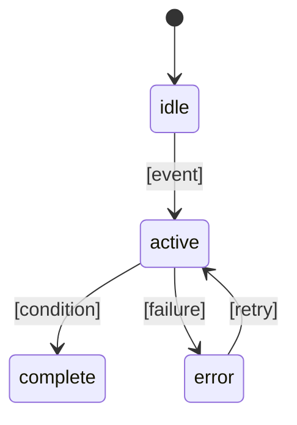

# 機能設計書

## 対象範囲と要件対応

| PRD要件 | 設計箇所 | テスト観点 |
| --- | --- | --- |
| [要件] | [節] | [観点] |

## 利用者フロー

### [フロー名]

1. [開始条件]
2. [操作とシステム応答]
3. [完了または失敗条件]

## 画面・View

### [画面 / View]

- 責務: [内容]
- 入力: [表示データ / 操作イベント]
- 出力: [表示 / 操作に対する応答]
- 状態の所有者・共有範囲: [内容]
- 状態の更新経路: [内容]
- 依存先: [モデル / サービス等]
- 禁止事項: [内容]

## データ契約

| 型・フィールド | Swiftの型 | 必須性・欠損の意味 | 許容値・初期値・制約 |
| --- | --- | --- | --- |
| [項目] | [型] | [内容] | [内容] |

必要に応じてSwiftの構造体・列挙型の例を併記する。

## 状態遷移

- 無効入力: [条件]
- 競合・重複防止: [方法]
- 非同期処理の寿命・キャンセル: [画面離脱や再実行時の扱い]

## サービス・外部インターフェース

| 対象 | 責務 | 入力 | 出力 | 失敗時 |
| --- | --- | --- | --- | --- |
| [Service] | [責務] | [入力] | [出力] | [振る舞い] |

## エラーハンドリング

| 条件 | 表示 | 復旧方法 | 記録 |
| --- | --- | --- | --- |
| [条件] | [表示] | [方法] | [方法] |

## テスト戦略

- 単体・統合テスト: [規則・状態遷移・サービスの境界]
- UIテスト: [主要な画面操作と表示の変化]
- 起動・Simulator・実機確認: [対象と必要な端末条件]
- 既存の検証構成: [確認済みのproject/workspace、scheme、destination、test target等。未作成・未確認は明記]

## 未決事項

- [事項]
