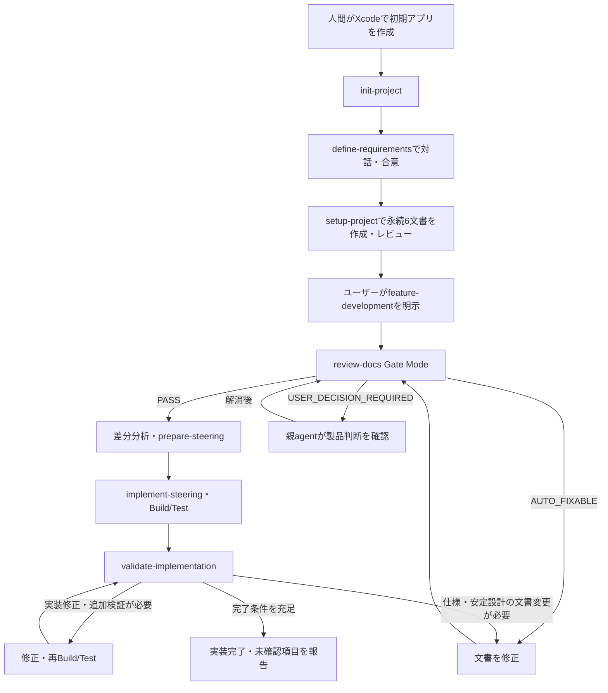

# Swift iOS AI Development Template

Swift / SwiftUIのネイティブiOSアプリを、Codexと一緒に要件定義から実装・検証まで開発するための再利用テンプレートです。

Ideasや要求整理では人間とAIが対話して製品仕様を決めます。6つの永続ドキュメントが確定した後は、`$feature-development` の1回の明示で、仕様レビュー、差分分析、計画、実装、Build/Test、独立検証、修正・再検証までを進めます。

**このリポジトリに含まれるのはAI開発環境です。** アプリ本体、アプリ固有の要件、Xcodeプロジェクトは含まれません。実際のアプリリポジトリへ導入して使用します。

## 目次

- [1. 開発の全体像](#overview)
- [2. 必要な環境と導入手順](#installation)
- [3. 新規アプリを初めて開発する](#first-development)
- [4. 既存アプリへ機能を追加・変更する](#incremental-development)
- [5. 必要な工程だけを個別実行する](#individual-workflows)
- [6. Workflow Skillの入力と出力](#workflow-reference)
- [7. 仕様・設計・進捗をどこに保存するか](#documents)
- [8. Interactive ReviewとGate Review](#document-review)
- [9. 自律実装の内部処理と判断範囲](#autonomous-development)
- [10. Build・Test・起動確認](#build-and-test)
- [11. Validationと完了報告の読み方](#validation)
- [12. 中断した開発を再開する](#resume)
- [13. Agentと専門Skillの役割](#agents-and-skills)
- [14. Codex設定と実行権限](#configuration)
- [15. 困ったときの確認先](#troubleshooting)
- [16. このテンプレート自体を更新する](#maintenance)

本文の依頼例はCodexの会話欄に入力します。`$feature-development` などはシェルコマンドではありません。例に登場するアプリ名、日付、仕様・steeringのパスは説明用です。実際に生成されたパスへ置き換えてください。

<a id="overview"></a>

## 1. 開発の全体像

### 人間とCodexの分担

| 領域 | 人間が担当すること | Codexが担当すること |
| --- | --- | --- |
| 開発環境 | macOS・Xcode・必要なSimulator runtimeの用意、初期Xcodeプロジェクトの作成 | 既存構成の調査、最小開発基盤の整備、利用可能な検証の確認 |
| 要件・仕様 | 利用者、目的、製品動作、対象外、重要な選択肢への回答・合意 | 曖昧さの発見、質問、代替案の比較、合意済み仕様の保存 |
| 設計文書 | 製品判断を伴う未決事項の解消、初期PRDへの承認 | 6文書の作成、文書間の整合性確認、レビュー |
| 自律実装 | 停止条件に該当する製品判断、実行環境で必要な権限対応 | 差分計画、内部設計、実装、Build/Test、回帰確認、修正・再検証 |
| 実機確認 | 必要な実機の用意、Codexが実行できない実機操作 | 実機限定項目の特定、確認手順・確認済み範囲の記録 |

ここでいう自律化は、**確定した要求を実装する工程を、工程ごとの承認なしで進めること**です。製品仕様を新しく決める場面、実行権限が必要な場面、実機での確認は、それぞれの条件に従います。



図の `init-project`、`define-requirements`、`setup-project` は個別に呼び出します。次の工程が案内されても自動実行はしません。`feature-development` の内側では、Gate、計画、実装、検証、修正を続けて実行します。

<a id="installation"></a>

## 2. 必要な環境と導入手順

### 技術前提

| 項目 | このテンプレートの前提 |
| --- | --- |
| 開発言語 | Swift |
| UI | SwiftUI |
| プラットフォーム | native iOS |
| IDE・ビルド | Xcode |
| Build/Test実行環境 | macOS、Xcode、対応するiOS SDK・Simulator runtime |
| AI開発環境 | リポジトリのSkillsとcustom agentsを利用できるCodex |
| ソース・文書の履歴 | Git |

Xcodeバージョン、Swiftコンパイラ、Swift言語モード、最低対応iOS、対象端末はテンプレートでは固定していません。対象アプリで確認・合意し、[PROJECT_CONTEXT.md](PROJECT_CONTEXT.md)へ記録します。すでに確定している値を、ビルドエラーの回避や初期化の都合で変更しません。

このテンプレートは、XcodeGen、Tuistなどによる初期project/workspace生成を行いません。SwiftLint、CocoaPodsなどの外部ツールや依存も標準では追加しません。導入する場合は、必要性と導入範囲を別途合意します。

### 新しいアプリリポジトリへ導入する

1. 利用する版のテンプレートを取得し、対象アプリのリポジトリを用意します。
2. 下表のファイル・ディレクトリを、対象アプリのリポジトリルートへ配置します。隠しディレクトリも含めてください。
3. `PROJECT_CONTEXT.md`の目的を対象アプリに合わせ、確定済みの技術設定を記録します。未確定の値は推測で埋めず、未決であることを示します。
4. 人間がXcodeで「iOS App / SwiftUI / Swift」のプロジェクトを作成し、対象アプリのリポジトリへ保存します。すでにアプリがある場合は、そのproject/workspaceを利用します。
5. Codexで対象アプリのリポジトリルートを開き、`$init-project`から開始します。

| 配置対象 | 用途 |
| --- | --- |
| `.agents/` | Workflow・専門Skill・参照契約・文書テンプレート |
| `.codex/config.toml` | マルチエージェント設定 |
| `.codex/agents/` | 文書作成、計画、レビュー、実装検証のAgent定義 |
| `AGENTS.md` | リポジトリの作業規則とSkillの呼び出し方 |
| `PROJECT_CONTEXT.md` | プロジェクトの目的・技術前提 |

ファイルを移植する場合、テンプレートの`.git/`を既存アプリへコピーしません。既存の`AGENTS.md`、`.codex/config.toml`、同名Skill・Agentがある場合は、アプリ固有の規則を保持してマージします。テンプレートのREADMEは利用手順の参考資料として扱い、アプリのREADMEを一律に上書きする必要はありません。

### 既存アプリへ導入する場合

まず既存コード、テスト、文書、Gitの作業状態を確認します。`$init-project`は既存アプリを再生成せず、不足する開発基盤だけを扱います。

| 現在の状態 | 開始位置 |
| --- | --- |
| Xcodeプロジェクトがない | 人間がXcodeで作成してから`$init-project` |
| アプリはあるが初期要件を整理していない | `$init-project`の後に`$define-requirements` |
| 初期要件は固まったが永続6文書が不足している | `$setup-project`。既存文書があれば更新対象を確定する |
| 永続6文書が確定し、一部または全部が実装済み | `$feature-development`がコード・履歴・証跡と比較して未達を特定する |
| 既存アプリの製品動作を変更したい | `$define-requirements`で変更仕様に合意してから追加開発する |

<a id="first-development"></a>

## 3. 新規アプリを初めて開発する

### Step 1: 既存Xcode構成を確認する

Codexへ入力します。

```text
$init-project
```

Codexはproject/workspace、scheme、app/test target、configuration、destination、XcodeとSwiftの設定を調査します。必要なら`.gitignore`などを整え、実行可能なbuild/testと未確認項目を報告します。

project/workspaceがなければ、人間によるXcodeでの作成を案内して停止します。このSkillの完了時点では、アプリの機能要件や実装計画はまだ作りません。

### Step 2: 初期要件を対話で固める

最初から完成した仕様書を用意する必要はありません。例えば次のように始めます。

```text
$define-requirements
短い動画にメモを付けて端末内に保存するiPhoneアプリを作りたいです。
主な利用者は、作業の経過を自分用に記録したい人です。
初期版には録画、メモ編集、一覧表示、再生を含めたいです。
アカウント登録、クラウド同期、共有は初期版の対象外です。
保存に失敗したときやカメラ権限を拒否したときの挙動も相談したいです。
```

Codexは目的、利用者、主要操作、例外、対象外、Acceptance Criteriaを整理します。重要な質問を原則1ラウンド2〜4問に絞り、回答に応じて具体化します。確定内容への合意後、`document_author`が`docs/ideas/initial-requirements.md`へ保存します。

初期要件の必須領域は次の6つです。

| 領域 | 書く内容の例 |
| --- | --- |
| Project Overview | アプリ名、一文での説明、解決したい問題 |
| Users | 主な利用者と利用場面 |
| Product Goals | 初期版が達成する具体的な目標 |
| In Scope | 初期版に含める機能 |
| Out of Scope | 初期版に含めない機能 |
| Acceptance Criteria | 条件・操作・観測可能な結果から成る受け入れ条件 |

ACの書き方の例は「カメラ権限を拒否した状態で録画を開始すると、録画を開始せず、権限が必要であることと復帰方法を表示する」です。これは書き方の説明であり、対象アプリへの要件追加ではありません。

初期要件の内容判定は`missing`、`blank`、`valid`です。`valid`は必須領域が具体的に埋まっていることを表し、ユーザー合意や実装開始可否の判定とは別です。詳細は[初期要件の共通判定](.agents/skills/define-requirements/references/initial-requirements-validation.md)を参照してください。

Ideasや仕様を先にレビューしたい場合は、実在する文書を指定します。

```text
$review-docs docs/ideas/initial-requirements.md
```

レビューは読み取り専用です。指摘への回答や仕様修正は、その後の要件整理で扱います。

### Step 3: 永続6文書を作成する

初期要件への合意後に入力します。

```text
$setup-project
```

作成順は次のとおりです。

1. `docs/product-requirements.md`を作成する。
2. PRDをInteractive Modeでレビューし、ユーザーが承認する。
3. `docs/functional-design.md`を作成する。
4. `docs/architecture.md`を作成する。
5. `docs/repository-structure.md`を作成する。
6. `docs/development-guidelines.md`を作成する。
7. `docs/glossary.md`を作成する。
8. 6文書全体をInteractive Modeでレビューする。

この工程は人間と仕様・設計を確定する領域です。PRD承認や重要な未決事項への回答があります。ファイルが6つ存在するだけでは、仕様が確定したことにはなりません。最終レビューに残った製品判断を解消してから自律実装へ進みます。

`$setup-project`は文書作成までで終了します。アプリコードや`.steering/`は作りません。

### Step 4: 実装から検証まで一括実行する

永続6文書の確定後に入力します。

```text
$feature-development
```

引数なしの場合は、現在の永続6文書全体を対象に未達要求を調べます。初回は未実装部分を計画し、実装済み部分があればその状態と証跡を確認します。

CodexはGate Review、計画、実装、Build/Test、Validationを順に進めます。通常の失敗は修正・再検証へ戻し、「次の工程へ進んでよいですか」という承認は求めません。進捗や判明した問題は途中で共有します。

完了時は、実装した内容、Gate/Validationの判定、Build/Test・回帰確認の結果、steeringと証跡の場所、未確認項目を確認してください。

<a id="incremental-development"></a>

## 4. 既存アプリへ機能を追加・変更する

### 変更仕様を合意してから渡す

例えば、動画にタグを付ける機能を追加する場合です。

```text
$define-requirements
既存の動画メモアプリにタグ付けとタグによる絞り込みを追加したいです。
録画・保存・再生の既存動作は維持したいです。
タグの重複、タグ削除時の動画の扱い、タグ未設定の動画の表示を相談したいです。
```

合意後、日付付きの仕様が`docs/ideas/YYYYMMDD-[feature-name].md`へ保存されます。既存仕様を修正する場合は対象パスを指定し、指定されたファイルを更新します。`Status: confirmed`は確定内容への合意後に付与します。

生成されたパスが`docs/ideas/20260929-video-tags.md`なら、次のように引き渡します。

```text
$feature-development docs/ideas/20260929-video-tags.md
```

この呼び出しでは、`document_author`が合意済みの変更を関連する永続文書へ反映し、更新後の6文書をGate Reviewへ渡します。日付付きspecを渡しても、自律実装の正本は永続6文書です。

`$define-requirements`自体は永続文書やコードを更新しません。保存先を確認し、そのspecを次の工程へ渡してください。

### 要求差分の分類

Codexは現在の6文書、コード・テスト、Git履歴、既存Validationの証跡、今回合意した変更要求を比較します。

| 分類 | 例 | 実装・検証への反映 |
| --- | --- | --- |
| `Unchanged` | 録画と再生の要求は変更しない | Verified済みの実装を維持する。タグ保存などの変更が影響する場合は回帰確認する |
| `Added` | タグ登録とタグ絞り込みを追加する | 既存コードで満たせる部分を調べ、不足だけ実装・検証する |
| `Modified` | 一覧の表示順を撮影日時順から更新日時順へ変更する | 変更された動作と依存する表示・テストを更新する |
| `Removed` | 既存の共有機能を廃止することに合意した | 削除意図、互換性、データ、依存、回帰影響を確認して対応する |

要求の分類と実装・検証状態は別です。`Unchanged`でも未実装なら是正対象になり、未検証なら先に証跡収集やテストを行います。履歴が不足している場合も、全要求を新規と見なして作り直しません。

文書から項目が消えただけでは、機能削除への合意と扱いません。`Removed`でもコード削除が要求されていなければ機械的に削除せず、データ破棄などの不可逆操作は停止条件で扱います。

追加開発の最終Validationでは、差分に加えて現在の永続6文書全体と実装の整合を確認します。明示的に今回の範囲を限定しても、他の有効な要求が未達なら、全体完了とは報告しません。詳細は[差分開発の手順](.agents/skills/feature-development/references/incremental-development.md)を参照してください。

<a id="individual-workflows"></a>

## 5. 必要な工程だけを個別実行する

一括実行のほかに、計画を先に確認したい場合や、変更を加えず検証結果だけを得たい場合は、個別Skillを使えます。

### 計画だけ作る

```text
$prepare-steering docs/ideas/20260929-video-tags.md
```

入力は確定した日付付きspecです。永続6文書も必要です。`requirements.md`、`design.md`、`tasklist.md`を作成したら終了し、コードは変更しません。次の工程には、報告された実際のsteeringパスを渡します。

`docs/ideas/initial-requirements.md`からの直接計画は受け付けません。初回は`$setup-project`で永続6文書を確定してから、`$feature-development`を使います。

### 指定した計画を実装する

```text
$implement-steering .steering/20260929-video-tags/
```

指定steeringのtaskに従って実装・テストし、進捗と証跡を同期します。単独実行ではtaskごとの実装をworkerへ委任します。独立した最終ValidationはこのSkillの完了に含まれず、次の操作として案内されます。

### 実装を変更せず検証する

```text
$validate-implementation .steering/20260929-video-tags/
```

`implementation_validator`が要求、設計、コード、テスト、証跡を照合し、`PASS`、`FAIL`、`BLOCKED`を返します。単独呼び出しでは修正やtasklist更新を始めません。必要なbuild/testの追加証跡はmain agentが実行して渡します。

修正する場合は、同じsteeringを指定して`$implement-steering`を実行し、その後に`$validate-implementation`を再実行します。修正反復まで一括で管理させる場合は、永続文書の確定状態と既存計画を確認したうえで`$feature-development`を明示します。

<a id="workflow-reference"></a>

## 6. Workflow Skillの入力と出力

| Skill | 入力 | 主な成果物・結果 | 単独呼び出しの終了地点 |
| --- | --- | --- | --- |
| [`$init-project`](.agents/skills/init-project/SKILL.md) | 対象リポジトリ。省略時は現在のルート | 既存Xcode構成の確認、必要な最小基盤、検証結果 | 初期基盤の確認・整備 |
| [`$define-requirements`](.agents/skills/define-requirements/SKILL.md) | アイデア、または対象の`docs/ideas/*.md` | 初期要件または日付付きconfirmed spec | 合意内容の保存 |
| [`$setup-project`](.agents/skills/setup-project/SKILL.md) | `docs/ideas/initial-requirements.md` | 永続6文書、PRDレビュー、6文書レビュー | 文書作成・レビュー |
| [`$review-docs`](.agents/skills/review-docs/SKILL.md) | `docs/`配下のMarkdown。省略時は永続6文書 | 6観点の点数、重大度別件数、判定、指摘 | 読み取り専用レビューの報告 |
| [`$feature-development`](.agents/skills/feature-development/SKILL.md) | 確定永続6文書。変更spec・機能名・再開steeringは任意 | 必要な文書更新、計画、実装、検証証跡、最終判定 | 完了条件の充足、または理由を明示した中断 |
| [`$prepare-steering`](.agents/skills/prepare-steering/SKILL.md) | 単独では日付付きconfirmed spec | 指定steeringの3計画文書 | 計画作成 |
| [`$implement-steering`](.agents/skills/implement-steering/SKILL.md) | 対象`.steering/`を1件 | 実装・テスト、計画との整合、進捗・証跡更新 | 指定計画の実装・検証 |
| [`$validate-implementation`](.agents/skills/validate-implementation/SKILL.md) | 対象`.steering/`を1件と関連文書・コード・証跡 | 独立した実装判定、要求対応表、残課題 | 判定の報告 |

`$feature-development`配下のprepareには、親が同じ版のGate PASS、永続6文書、要求差分、調査結果、出力先を渡します。単独prepareの日付付きspec要件を満たすために、架空のspecを作ることはしません。

`$review-docs`は自然文の文書レビュー依頼でも利用できます。その他のWorkflowの開始には、`$skill-name`を明示してください。個別Skillを指定した場合は、その工程だけを許可したものとして扱います。

<a id="documents"></a>

## 7. 仕様・設計・進捗をどこに保存するか

### 含まれているものと、開発時に作られるもの

```text
対象アプリのリポジトリ/
├── AGENTS.md                     # テンプレート: 作業規則・routing
├── PROJECT_CONTEXT.md            # テンプレートをアプリの前提へ更新
├── .agents/
│   ├── README.md                  # Skill・Agent構成の概要
│   ├── skills/                    # テンプレート: 15個のSkill
│   └── workspaces/                # 作業用領域。進捗の正本は.steering/
├── .codex/
│   ├── config.toml                # テンプレート: agentsの設定
│   └── agents/                    # テンプレート: 4個のcustom agent定義
├── docs/                          # 要件・設計工程で作成
│   ├── ideas/
│   │   ├── initial-requirements.md
│   │   └── YYYYMMDD-feature-name.md
│   ├── decisions/                 # 決定記録が必要なときに使用
│   ├── product-requirements.md
│   ├── functional-design.md
│   ├── architecture.md
│   ├── repository-structure.md
│   ├── development-guidelines.md
│   └── glossary.md
├── .steering/                     # 計画・実装工程で作成
│   └── YYYYMMDD-task/
│       ├── requirements.md
│       ├── design.md
│       └── tasklist.md
└── アプリのproject/workspaceとソース # 初期projectは人間がXcodeで作成
```

これは役割を示す構成例です。`docs/`、`.steering/`、アプリの構成は、このテンプレート自体にはまだありません。アプリソースとテストの配置は、対象アプリの設計と実際のXcode構成で決めます。

### 永続6文書の役割

| 文書 | 主に決めること | 内容の例 |
| --- | --- | --- |
| `product-requirements.md` | 何を、誰のために作るか | 利用者、製品目標、優先度、P0、禁止動作、要求、AC、対象外 |
| `functional-design.md` | 機能がどのように振る舞うか | 画面、ユーザーフロー、状態遷移、データ、正常・異常系 |
| `architecture.md` | 技術と責務をどう構成するか | モジュール境界、依存方向、状態・データ管理、品質特性 |
| `repository-structure.md` | ファイルをどこに配置するか | ディレクトリの責務、命名、機能・共通・テストの配置 |
| `development-guidelines.md` | どう実装・検証するか | Swift/SwiftUI規約、並行処理、テスト、Build、Git、完了条件 |
| `glossary.md` | 用語をどう統一するか | 製品用語、技術用語、状態名、表記・意味の定義 |

P0はプロジェクトで最優先として定義した要求、ACはAcceptance Criteria（受け入れ条件）です。具体的な優先度や禁止動作はアプリごとの合意内容に従います。

### 正本の使い分け

| 情報 | 正本 |
| --- | --- |
| プロジェクトの目的・技術前提 | `PROJECT_CONTEXT.md` |
| Codexの作業規則・Workflow routing | `AGENTS.md` |
| 初期の要件整理とbootstrap入力 | `docs/ideas/initial-requirements.md` |
| 合意した追加・変更仕様 | `docs/ideas/YYYYMMDD-[feature-name].md` |
| 安定した製品仕様・設計・開発規則 | `docs/`の永続6文書 |
| 実装単位の要求・設計・進捗・検証証跡 | 対象`.steering/`の3文書 |
| Workflowの入力・実行・完了条件 | 各`SKILL.md`とそこから参照する契約 |

READMEはこれらを利用するための案内です。判定基準の正本は、[レビュー共通基準](.agents/skills/review-docs/references/review-criteria.md)、[Validation契約](.agents/skills/validate-implementation/references/validation-contract.md)、[自律判断Policy](.agents/skills/feature-development/references/autonomy-policy.md)です。

### steeringに残る情報

`requirements.md`には実装対象、AC、対象外、正本参照、要求差分と比較基準を、`design.md`には現状、責務分割、影響範囲、テスト戦略、判断根拠を記録します。

`tasklist.md`にはtaskの所有者、変更ファイル、依存順、完了条件、検証方法、進捗を記録します。親WorkflowではGate/Validationの対象版と結果、修正履歴、Traceability、過去Verifiedを再利用した根拠、実機確認待ち、阻害要因と再開点も集約します。

| task状態 | 意味 |
| --- | --- |
| `pending` | 未着手 |
| `in-progress` | 所有者と対象を確定して作業中。自律修正できる失敗もここで扱う |
| `done` | 受け入れ条件を満たし、検証証跡がある |
| `blocked` | 外部判断や環境不足により進めない。理由を記録する |
| `cancelled` | 方針変更などで不要になった。理由を記録する |

実機限定の検証taskは実装taskと分け、未確認のまま`done`にしません。`blocked`のtaskに依存する作業は進めず、独立して実行できるtaskを進めます。

<a id="document-review"></a>

## 8. Interactive ReviewとGate Review

両モードとも同じ`review-docs` Skillと`doc_reviewer`を使用します。レビュー担当は文書を変更せず、指摘と判定を返します。

| 観点 | Interactive Mode | Gate Mode |
| --- | --- | --- |
| 主な用途 | Ideas、要求整理、仕様の壁打ち | 自律実装を開始できるかの判定 |
| 通常の入口 | `$review-docs`、自然文の文書レビュー依頼 | `$feature-development`内。実装開始可否を明示した単独レビューにも対応 |
| 対象 | 指定した`docs/`内のMarkdown。省略時は6文書 | 永続6文書全体 |
| ユーザーへの質問 | 必要な質問、代替案、A/B比較を提示できる | reviewerは直接質問せず、親へ判断材料を返す |
| FAIL後 | 壁打ちを続けて仕様を具体化する | 親が自動修正または停止条件への対応を行う |

1文書だけをInteractiveでレビューしてPASSになっても、永続6文書全体のGate PASSにはなりません。単独Gateは判定結果を報告して終了し、修正や実装は開始しません。

### 評価する6観点

| 観点 | 具体的に見ること |
| --- | --- |
| 完全性 | 要求、P0、禁止動作、正常・異常系、AC、必要な前提が揃っているか |
| 一貫性 | 文書間で要求・設計・用語・規則が矛盾していないか |
| 明確性 | 条件、状態遷移、境界、用語を一意に読めるか |
| 検証可能性 | 条件と観測可能な結果、確認方法・環境が定義されているか |
| 実現可能性 | Swift/SwiftUI/iOS/Xcodeの確定条件と設計で実現できるか |
| スコープ明確性 | 対象・対象外、変更・削除の影響、依存が分かるか |

各観点を1.0〜5.0点、必要なら0.5点刻みで評価します。報告には各点数、平均、Critical/Major/Minor/Suggestionの件数、PASS/FAIL、根拠と修正案が含まれます。

### Gate PASSの条件

次の8条件をすべて満たす必要があります。正確な定義は[レビュー共通基準](.agents/skills/review-docs/references/review-criteria.md)を参照してください。

1. 総合平均が4.5 / 5.0以上。
2. 6観点すべてが4.0 / 5.0以上。
3. Criticalが0件。
4. Majorが0件。
5. 未解決の要求矛盾が0件。
6. 製品仕様を推測しないと実装時に決められない事項が0件。
7. 検証不能なACが0件。
8. P0要求または禁止動作の重大な定義不足が0件。

Minor/Suggestionを残せるのは、製品動作・要求・ACに影響しない場合だけです。平均点が高くてもCritical/MajorがあればFAILです。

### FAILと未実施の扱い

| 結果 | 例 | 次の処理 |
| --- | --- | --- |
| `AUTO_FIXABLE`なblocking issue | 確定済み用語との表記不一致、正しい参照先が一意なリンク誤り | 親が`document_author`へ修正を委任し、6文書全体を再レビューする |
| `USER_DECISION_REQUIRED`なblocking issue | PRDは端末内保存のみ、別の文書は自動クラウド送信を要求している | 親が該当する停止条件と影響を説明し、製品判断を確認する |
| `review_status: NOT_RUN` | 必須文書がない、入力が不正、reviewerが使えない | 未実施理由を解消する。点数やPASS/FAILは作らない |

実機が必要でも、確認条件・手順・期待結果が定義されていればACは検証可能です。「現在実機がないこと」と「ACの確認方法を定義できないこと」は区別します。

<a id="autonomous-development"></a>

## 9. 自律実装の内部処理と判断範囲

### `$feature-development`が管理する処理

1. `AGENTS.md`、`PROJECT_CONTEXT.md`、永続6文書、Git作業状態を確認する。
2. 指定されたconfirmed specがあれば、合意済み変更を永続文書へ反映する。
3. コード・テスト・履歴・過去証跡を調査し、要求差分を仮整理する。
4. 独立したGate Reviewを実行し、自動修正できる文書の問題は修正して再レビューする。
5. Gate PASS後に差分分析を確定し、`prepare-steering`で計画を作る。
6. `implement-steering`に従い、実装、テスト、進捗・証跡更新を行う。
7. 現在のコードに対するBuild/Test、必要な回帰・起動確認を実行する。
8. 独立したValidationで6文書全体とのTraceabilityと回帰を判定する。
9. 未実装・不具合・自動修復可能な検証不足を修正し、Build → Test → Validationを繰り返す。
10. 完了条件と最終diffを確認し、結果を報告する。

仕様や安定設計の文書が変わった場合は、更新後の6文書のGateから再実行します。親はreviewerやvalidatorの点数・判定を独自に上書きしません。

### Codexが自分で決めること

実装順序、ファイル・class・関数の分割、内部API、内部状態管理、テスト構成、軽微なリファクタリング、通常のBuild/Test/Lint失敗への対応、Review/Validation指摘の自動修正はmain agentが判断します。

根拠は、永続6文書 → P0要求 → 禁止動作 → AC → `AGENTS.md` → `PROJECT_CONTEXT.md` → 既存Architecture → 既存コードの慣例 → 後方互換性 → 小さい変更範囲 → 可逆的な選択、の順で確認します。P0・禁止動作・ACは同時に満たす制約であり、正本同士の製品動作の矛盾を順位だけで解消しません。

### ユーザー判断が必要になる条件

次の条件に該当する場合、親agentが影響する作業を止め、根拠と必要な判断をまとめて返します。

| 停止条件 | 具体例 |
| --- | --- |
| 正本同士が矛盾し、選択で製品動作が変わる | 保存先が端末内限定なのかクラウド同期必須なのか一致しない |
| 明示要求の追加・削除・変更が必要で未合意 | 実装を容易にするために既存のACを外す必要がある |
| P0要求または禁止動作を満たせない | 最優先のオフライン利用と必須外部通信が両立しない |
| 技術的に要求が成立せず、代替仕様が必要 | 対象環境で利用できない端末機能を必須動作としている |
| 大規模なArchitecture変更が必要 | 既存の保存方式や主要モジュール境界を全面的に変える必要がある |
| 不可逆な操作が必要 | ユーザーの既存データを破棄する移行が必要 |
| Security/Privacy上の重大な製品判断が必要 | 個人データの新しい送信先や保存方針を決める必要がある |
| 外部サービス・本番環境・課金へ重大な影響がある | 有料サービスの契約や本番データへの操作が必要 |

Build失敗、Test失敗、Review FAIL、Validation FAILという結果だけでは工程承認を求めません。停止条件に該当しなければ調査・修正を続けます。環境やAgentが使えない場合は復旧可能性を調べ、依存しない作業を終えたうえで、残る外部阻害と再開条件を未完了として報告します。

<a id="build-and-test"></a>

## 10. Build・Test・起動確認

### コマンドを決める前に確認する構成

Codexは、利用するproject/workspace、workspace内の参照、scheme、app/test target、configuration、Test actionまたは採用済みtest plan、Swift設定、利用可能なdestinationを確認します。

project名やSimulator名を推測してコマンドを作りません。複数の入口がある場合は用途を調べます。build用のgeneric destinationと、テスト実行可能な具体的destinationも区別します。

手動で構成を確認する場合の例です。`<...>`を実在する値へ置き換えてください。workspaceを使う場合は`-project`を`-workspace`へ置き換え、両方を同時に指定しません。

```sh
xcodebuild -list -project "<確認するprojectパス>"
xcodebuild -project "<確認済みprojectパス>" -scheme "<確認済みscheme>" -showdestinations
```

構成確認後のBuild/Testの形は次のとおりです。

```sh
xcodebuild -project "<確認済みprojectパス>" -scheme "<確認済みscheme>" -configuration "<確認済みconfiguration>" -destination "<確認済みbuild用destination>" build
xcodebuild -project "<確認済みprojectパス>" -scheme "<確認済みscheme>" -configuration "<確認済みconfiguration>" -destination "<確認済みtest用destination>" test
```

これらは一律の実行スクリプトではありません。実際の引数、検証対象、権限、出力先は[共通Xcode検証手順](.agents/skills/development-guidelines/references/process.md)と対象アプリの開発規則に従って決めます。

### 成功と見なすために確認すること

| 確認 | 意味・注意点 |
| --- | --- |
| Build | コンパイル・リンクと診断を確認する。実行時動作の証明とは別 |
| 自動Test | 実行テスト数、失敗数、skip数を確認する。終了コード0だけで合格にしない |
| Regression | 追加・変更した処理が既存要求を壊していないか確認する |
| 起動・画面 | Simulatorまたは実機で確認する。BuildやPreviewだけで代用しない |
| 実機限定AC | 実機が必要な理由、確認済み範囲、残る手順を明示する |
| Coverage | 対象・測定条件・閾値が開発規則で合意済みの場合だけ評価する |

`$feature-development`では自動Testの成功が完了条件です。テスト構成がなければ未設定のまま合格にせず、親が計画taskとして不足を補います。Apple標準のSwift TestingまたはXCTestを用い、人間が作成済みのproject内でtest target、所属、Test action/test plan、共有schemeなどの不足構成を整え、再度一覧と実行先を確認します。

この処理でも、初期project/workspaceの独自生成、合意外の外部テスト基盤導入、署名・Team・Capabilitiesや確定技術設定の無断変更は行いません。単独Validationは不足を報告し、構成自体は変更しません。

### 検証証跡に残すもの

実行コマンド、日時、ツール版、対象project/workspace・scheme・configuration・destination、コード版、テスト実行数・skip数・失敗数、結果、ログやresult bundleの場所を記録します。未コミット差分も含め、どのコードを検証した結果なのかを追跡します。

Xcodeの一覧取得もキャッシュや依存解決への書き込みを伴う場合があります。DerivedData、result bundle、Simulator状態などの書き込みは実行環境の権限に従います。read-onlyのvalidatorが権限を変更して実行することはなく、mainへ必要な確認を返します。

<a id="validation"></a>

## 11. Validationと完了報告の読み方

Validationは`validate-implementation`が担当し、独立した`implementation_validator`が判定します。`implement-validation`という別名のSkillは使用しません。

### 要求と実装を結ぶTraceability

Traceabilityは「どの要求を、どのコードで実装し、どのテスト・証跡で確認したか」の対応関係です。要求・ACのIDがあれば維持し、なければ文書パス・見出し・項目を安定した参照として使います。

実装状態と検証状態は別々に追跡します。

| 軸 | 状態 | 意味 |
| --- | --- | --- |
| 実装 | `Implemented` | 要求の全実装をコードで確認できる |
| 実装 | `Not Implemented` | 未実装、部分実装、要求された動作が不足している |
| 実装 | `未判定（根拠不足）` | 実装を確定できる根拠がない。PASSにしない |
| 検証 | `Verified` | 現在の仕様・コードに適用できる確認成功の証跡がある |
| 検証 | `Not Verified` | 証跡不足、未実行、環境不足、0件実行、必須確認のskipなど |
| 検証 | `Failure` | 実行した確認が要求・ACを満たしていない |
| 両軸 | `Not Applicable` | 現在の仕様上、対象外である根拠がある。軸ごとに理由を示す |

`Implemented`でも`Not Verified`という組み合わせはあり得ます。実行時ACをコード読解やbuild成功だけで`Verified`にしません。

例えば、対応表には次のような情報を残します。下表は形式を説明するための架空例です。

| 要求・AC | 差分 | 実装状態 | 検証状態 | 根拠・残課題 |
| --- | --- | --- | --- | --- |
| TAG-01 タグで一覧を絞り込める | Added | Implemented | Verified | 実装位置、テスト名、実行ログ、対象コード版 |
| PLAY-01 保存動画を再生できる | Unchanged | Implemented | Verified | 既存証跡と今回の変更の影響分析、必要な回帰結果 |
| DEVICE-01 実機カメラで撮影した映像・音声を再生できる | Unchanged | Implemented | Not Verified - requires physical device | 実機が必要な理由、確認済みコード/Simulator範囲、実機手順 |

### 最終判定

| 判定 | 意味 | 親Workflowの行動 |
| --- | --- | --- |
| `PASS` | 契約上の実装・検証条件を満たす | 最終diffと証跡・tasklistを照合して完了報告する |
| `FAIL` | 未実装、検証失敗、回帰不具合、Critical/Major、既知の不整合がある | 停止条件に該当しなければ修正して再検証する |
| `BLOCKED` | 既知のFAILはないが、入力・証拠・環境・権限などが足りない | 自動修復可能な不足を補い、外部阻害は根拠と再開条件を返す |

既知の不具合と環境不足が同時にある場合、主判定はFAILとして両方を報告します。環境不足によって不具合を見えなくしません。

### `$feature-development`の完了条件

次の条件をすべて満たしたことを確認します。

1. 現行の永続6文書に対するGate ReviewがPASS。
2. CriticalとMajorが0件。
3. 現在のコードのBuildが成功。
4. 必要な自動Testが実際に実行され、成功。
5. 実装可能な要求がすべてImplemented。
6. 自動検証可能なACと、必要な回帰確認がすべて成功。
7. 独立したValidationがPASS。
8. 永続6文書全体の要求・設計制約と実装のTraceabilityを確認済み。
9. 最終diffを確認し、tasklistと検証証跡を同期済み。
10. 残る実機限定の未検証項目があれば、理由と確認手順を明示済み。

実機限定ACだけが未検証の場合は、すべてを`Not Verified - requires physical device`として明示し、実装完了と実機確認待ちを分けます。実装不足やSimulatorで確認できる項目を実機待ちへ分類して完了させることはできません。

最終報告は次のように読み分けてください。

| 報告 | 判断できること |
| --- | --- |
| コード実装・自動検証完了／実機確認待ち | 実装と必要な自動確認は完了。列挙された実機ACはまだ確認が必要 |
| 全AC Verified | 実機を含め、その報告が対象とする全ACに有効な成功証跡がある |
| 未完了・外部阻害あり | 完了条件を満たしていない。阻害要因と再開点を確認する |

実機確認待ちを含むPASSは「実装範囲PASS（実機確認残あり）」と報告します。判定の詳細は[Validation契約](.agents/skills/validate-implementation/references/validation-contract.md)を参照してください。

<a id="resume"></a>

## 12. 中断した開発を再開する

自律実装中の進捗は、対象`.steering/`を起点に確認します。新しい会話でも、同じsteering、永続文書、コード、検証証跡が残っていれば、保存された状態と現在値を比較して再開できます。

例えば次のように依頼します。これは専用CLI引数ではなく、Skill名と再開対象を明示する自然文です。

```text
$feature-development
.steering/20260929-video-tags/ の開発を再開してください。
tasklistの阻害要因と検証証跡を確認し、現在の文書・コードとの差分から
必要なGate、計画、Build/Test、Validationを再実行してください。
```

親agentは文書の版/hash、コードのcommitと未コミット差分、環境、過去判定の対象を確認します。再開しただけで、過去のPASSをそのまま現在のPASSにはしません。

| 中断理由 | 再開前に用意するもの |
| --- | --- |
| 製品判断待ち | 対象の矛盾・未決事項への回答と合意内容 |
| Xcode・Simulator不足 | 必要な環境が利用可能になった事実と対象構成 |
| 実行権限不足 | 実行環境で許可された範囲、または利用できる代替の検証方法 |
| Agent・Skillを認識できない | 配置・設定・利用環境の確認結果 |
| 実機確認待ち | 確認した端末・OS、対象コード版、実行手順・結果・証跡 |

再開時は既存計画と一致するsteeringを指定します。最新の日付だけを理由に無関係な計画へ切り替えたり、元のtasklistを初期化したりしません。

<a id="agents-and-skills"></a>

## 13. Agentと専門Skillの役割

### Agentの責務と書き込み範囲

| Agent | 担当 | 書き込み範囲 |
| --- | --- | --- |
| main | ユーザー対話、Workflow管理、調査、差分分析、実装・修正、Build/Test、結果統合 | 許可された対象。委任中の所有ファイルを同時編集しない |
| [`document_author`](.codex/agents/document_author.toml) | 合意済み仕様・永続文書の作成、親が指示する文書修正 | 指定された`docs/ideas/`または`docs/`の文書 |
| [`feature_planner`](.codex/agents/feature_planner.toml) | 確定入力から実装計画を作る | 指定steeringの`requirements.md`、`design.md`、`tasklist.md` |
| [`doc_reviewer`](.codex/agents/doc_reviewer.toml) | Interactive/Gateの独立評価 | read-only。対象文書を修正しない |
| [`implementation_validator`](.codex/agents/implementation_validator.toml) | 実装・AC・回帰・証跡の独立評価 | read-only。コード、テスト、文書、設定を修正しない |
| 組み込み`explorer` | 境界の明確なコード調査 | 読み取り中心 |
| 組み込み`worker` | 所有範囲を指定した実装・修正 | 委任されたファイル・ディレクトリ |

書き込みを委任するときは、所有範囲、入力、制約、完了条件を明示します。mainはAgentの報告だけで完了とせず、最終diffと所有範囲外の変更がないことを確認します。

### 内部で使う7つの専門Skill

| 専門Skill | 主な用途 |
| --- | --- |
| [`prd-writing`](.agents/skills/prd-writing/SKILL.md) | `product-requirements.md`の作成・更新 |
| [`functional-design`](.agents/skills/functional-design/SKILL.md) | `functional-design.md`の作成・更新 |
| [`architecture-design`](.agents/skills/architecture-design/SKILL.md) | `architecture.md`の作成・更新 |
| [`repository-structure`](.agents/skills/repository-structure/SKILL.md) | `repository-structure.md`の作成・更新 |
| [`development-guidelines`](.agents/skills/development-guidelines/SKILL.md) | 開発規則の作成・更新、実装時の規約参照 |
| [`glossary-creation`](.agents/skills/glossary-creation/SKILL.md) | `glossary.md`の作成・更新 |
| [`steering`](.agents/skills/steering/SKILL.md) | 計画・実装中の3文書と進捗・証跡の維持 |

専門Skillは担当Workflow・Agentが名前を明示して使用します。ユーザー向けの`prepare-steering`や`implement-steering`と、内部の`steering`は役割が異なります。配置の概要は[.agents/README.md](.agents/README.md)を参照してください。

<a id="configuration"></a>

## 14. Codex設定と実行権限

### リポジトリの設定

[.codex/config.toml](.codex/config.toml)の設定は次のとおりです。

```toml
[agents]
enabled = true
max_concurrent_threads_per_session = 4
```

マルチエージェントを有効にし、親を除く同時subagent数の上限を4にしています。常に4つ並列に実行する指定ではなく、文書の依存順やファイル所有に従って直列実行も行います。この設定キーの意味は[公式Config Reference](https://learn.chatgpt.com/docs/config-file/config-reference)を参照してください。

この構成はCodex CLI 0.158.0で確認しています。custom agentは`.codex/agents/*.toml`へ配置し、`name`、`description`、`developer_instructions`を定義します。reviewer/validatorは`read-only`、author/plannerは`workspace-write`です。検証済み版を最低対応版の保証とは扱わず、利用環境でも認識を確認してください。[公式Subagentsガイド](https://learn.chatgpt.com/docs/agent-configuration/subagents)

### 工程承認と実行権限は別

リポジトリの`.codex/config.toml`は、mainのapproval・sandbox設定を上書きしません。実行環境の既存設定を継承します。

`$feature-development`の許可により、配下工程と修正反復を進められます。一方、ネットワーク、保護ディレクトリ、Xcodeキャッシュ、Simulatorへの操作などは、実行環境に応じた権限確認が発生する場合があります。Workflowはその制約を回避しません。

また、Skillの呼び出しだけでは、外部依存の新規導入、署名・Team・Capabilities変更、commit/push/deployを包括的に許可したことにはなりません。Gitへの保存まで依頼したい場合は、例えば「変更をこのブランチへコミットしてpushしてください」と明示します。

### 導入時に確認する項目

Codex CLIを利用している場合、ターミナルで次を確認できます。

```sh
codex --version
codex --strict-config doctor --summary
```

このCLI版では`--strict-config`で未知の設定キーをエラーとして扱えます。診断が成功しても、個々のWorkflowを最後まで実行した証明にはなりません。利用するCodex環境でSkillとcustom agentが認識されているかも確認してください。

Skillの`agents/openai.yaml`には表示情報と`allow_implicit_invocation`があります。このテンプレートでは`review-docs`だけを暗黙呼び出し可能にし、その他は明示呼び出しにしています。暗黙呼び出しを無効にしたSkillも、ユーザーが指定するWorkflowや担当Agentからの明示使用に用います。

<a id="troubleshooting"></a>

## 15. 困ったときの確認先

| 状況 | 確認・対応 |
| --- | --- |
| 「機能を実装して」と頼んでも開始しない | Workflow routingに従い、`$feature-development`または必要な個別Skillを明示する |
| Skillを見つけられない | 対象ルート、`.agents/skills/<name>/SKILL.md`、YAMLの`name`と`description`、利用環境のSkill認識を確認する |
| custom agentを使えない | `.codex/agents/`、各TOML、`name`、`[agents]`の設定、利用するCodex版を確認する。独立評価をmainで置き換えない |
| `$init-project`がプロジェクト作成待ちで止まる | 人間がXcodeで作成したproject/workspaceを用意する。独自生成で補わない |
| `$setup-project`が`missing`または`blank`を返す | `$define-requirements`で初期要件の不足・空欄を埋める。ファイルの存在だけではvalidにならない |
| 永続6文書の一部がない | `$setup-project`へ戻り、既存内容を保持する更新範囲を確定する |
| 追加仕様の依頼が初期要件整理へ戻る | `define-requirements`のモード判定を確認する。初期要件の必須領域と永続6文書が揃っている必要がある |
| GateがFAILになる | 点数だけでなくblocking issueの根拠・分類を見る。自動修正は親が処理し、製品判断だけをユーザーへ返す |
| Gateが`NOT_RUN`になる | 文書パス、存在、`docs/`配下か、読込・Agent利用可否を確認する。FAILとは別の実行上の問題 |
| Testが0件なのにコマンドは成功する | test target、Test action/test plan、skip、destinationを確認する。0件を自動Test成功と扱わない |
| Build/Testの権限確認が出る | 出力先や必要な書き込みを確認する。工程承認の省略とsandboxの解除は別 |
| Validationが`BLOCKED`になる | 証跡・入力・環境の不足理由を確認する。自動修復可能なら親が補う |
| 実機が用意できない | 実装・自動検証を終え、実機限定AC、理由、確認手順を残す。全AC Verifiedとは報告しない |
| 完了報告後に文書やコードが変わった | 過去判定の対象版と比較し、影響するGate・Build/Test・Validationを再実行する |
| 追加開発で既存コードを作り直そうとしている | 過去Verifiedの証跡、比較基準、要求差分表を確認する。Unchangedと未実装・未検証を区別する |

<a id="maintenance"></a>

## 16. このテンプレート自体を更新する

テンプレートのWorkflow・Skill・Agent設定を変更する場合は、利用者向けのREADMEと実行規則の正本を分けて更新します。

| 変更内容 | 主な更新先 |
| --- | --- |
| ユーザー向けの開始条件・工程の許可範囲 | `AGENTS.md`、対象Workflowの`SKILL.md` |
| プロジェクトの技術前提 | `PROJECT_CONTEXT.md`、関連する技術ガイド |
| 文書レビューの採点・判定 | [review-criteria.md](.agents/skills/review-docs/references/review-criteria.md) |
| 実装状態・検証状態・PASS/FAIL/BLOCKED | [validation-contract.md](.agents/skills/validate-implementation/references/validation-contract.md) |
| 自律判断と質問が必要な条件 | [autonomy-policy.md](.agents/skills/feature-development/references/autonomy-policy.md) |
| 追加開発の比較・差分分類 | [incremental-development.md](.agents/skills/feature-development/references/incremental-development.md) |
| Agentの担当・制約 | `.codex/agents/*.toml` |
| 利用方法・具体例 | このREADMEと`.agents/README.md` |

レビューやValidationの詳細判定を複数のSkill・Agent設定へ独立に複製せず、共通契約を参照します。既存Skillを同じ役割の別名で増やすことも避けます。

変更後は、次を確認してください。

1. 変更ファイルを再読込し、入力、出力、正本、所有範囲、停止条件、完了条件がつながっていること。
2. `SKILL.md`のYAML front matterと`agents/openai.yaml`、Agent・configのTOML構文が正しいこと。
3. Skill名、Agent名、相対リンク、参照契約が実在すること。
4. Interactive/Gate、単独Workflow/親Workflow、実装/独立評価の責務が混ざっていないこと。
5. `git diff --check`と最終diffを確認し、対象外の変更がないこと。
6. 利用するCodexで設定を読み込め、Skill・Agentを認識できること。
7. 実アプリでの通し実行を行った場合は、その構成、範囲、結果、未確認項目を記録すること。

このテンプレートだけの変更を検証するために、Xcodeプロジェクトを生成する必要はありません。構文・参照・整合・認識確認と、実アプリでのE2E実行は別の検証として報告します。
